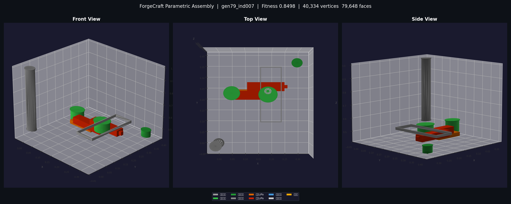
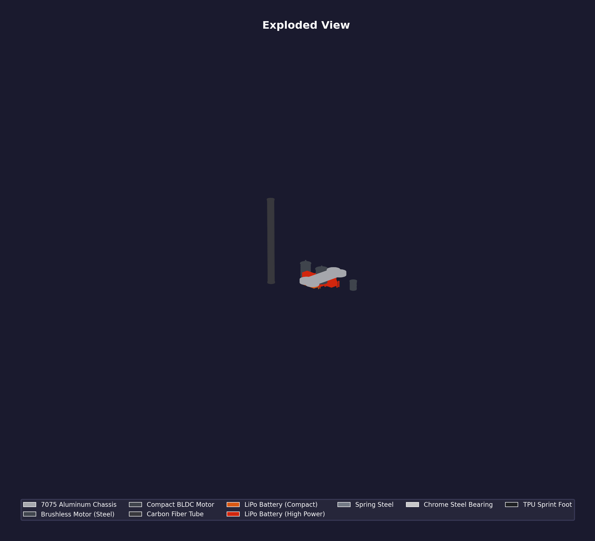

# ForgeCraft

> 基于强化学习的机械形态协同进化框架  
> RL-based Mechanical Morphology Co-Evolution Framework

**ForgeCraft** 将强化学习 (PPO + GNN) 与进化算法 (NSGA-II + MAP-Elites) 结合，自动设计、评估并优化机械形态。从零件级生成到物理仿真评估，再到 STL/STEP/URDF 制造文件导出，形成完整闭环。

---

## 快速开始

### 安装

```bash
# 1. 核心安装 (Python >= 3.10) — 仿真 / 形态建模 / 网格处理
pip install -e .

# 2. 开发环境 (含 pytest / ruff)
pip install -e ".[dev]"

# 3. (可选) GPU 仿真 (Genesis World, Python < 3.14)
pip install -e ".[gpu]"

# 4. (可选) 按需启用其他能力
pip install -e ".[analysis]"    # 有限元 / 等几何分析 (scipy)
pip install -e ".[dashboard]"   # 实时 Web 看板 (fastapi + uvicorn)
pip install -e ".[hpo]"         # 超参数优化 (optuna)
pip install -e ".[dist]"        # Ray 分布式
pip install -e ".[mfg]"         # 额外 STL 工具 (numpy-stl)
pip install -e ".[deploy]"      # ONNX 跨平台部署

# 5. 一键安装全部
pip install -e ".[all]"
```

### 30 秒进化一把

```bash
# CPU 模式 (默认)
python -m forgecraft.main --population 20 --generations 10

# GPU 模式 (需要 CUDA)
python -m forgecraft.main --cuda --population 50 --generations 50

# 导出制造文件 (STL / STEP / DXF / URDF / BOM / PBR 渲染)
python -m forgecraft.main --generations 100 --export --export-dir design_output

# 列出可用的零件箱 / 任务
python -m forgecraft.main --list-catalogs
python -m forgecraft.main --list-tasks
```

### 独立导出（从已有 best_body.json）

```bash
python -m forgecraft.manufacturing --body-file design_output/best_body.json --catalog primitives
```

---

## 示例产物

`examples/demo_robot/` 是一次完整进化（第 79 代）的交付物快照，可直接查看效果：

| 文件 | 说明 |
|------|------|
| `best_body.json` | 最佳形态（零件树 + 关节定义） |
| `gltf/gen79.glb` | 交互式 3D 装配体（任意 glTF 查看器可打开） |
| `gltf/gen79_exploded.glb` | 爆炸视图模型 |
| `renders/` | 7 视角渲染 + 3 张论文级渲染（正常 / 爆炸） |
| `parts_showcase/` | 参数化零件特写 |
| `bom.json` / `manufacturability.json` | 材料清单 + 可制造性评分 |
| `3d_viewer.html` | 单文件网页查看器（浏览器直接打开） |





---

## 核心能力

```
┌──────────┐    ┌──────────┐    ┌──────────┐    ┌──────────┐    ┌──────────┐
│ 形态生成  │ →  │ GNN 编码 │ →  │ PPO 训练 │ →  │ 物理仿真 │ →  │ 制造导出  │
│ catalog   │    │ encoder  │    │ policy   │    │ MuJoCo   │    │ STL/URDF │
│ generator │    │ batch    │    │ rollout  │    │ Genesis  │    │ STEP/BOM │
└──────────┘    └──────────┘    └──────────┘    └──────────┘    └──────────┘
      ↑                               │                               │
      │         进化引擎 (NSGA-II + MAP-Elites + 课程学习)             │
      └───────────────────────────────┴───────────────────────────────┘
```

| 功能 | 描述 |
|------|------|
| **形态自动设计** | 从零件箱 (catalog) 组装任意拓扑的机械形态 |
| **GNN 形态编码** | 图神经网络将形态编码为固定维度向量 |
| **PPO 强化学习** | 形态自适应 Actor/Critic 策略训练 |
| **物理仿真** | MuJoCo (CPU) 或 Genesis World (GPU, 43M FPS) |
| **多目标进化** | NSGA-II Pareto 前沿 + MAP-Elites 质量多样性 |
| **制造闭环** | STL / STEP AP242 / URDF / ONNX / BOM 五格式导出 |
| **错误恢复** | 原子断点 + 6 级降级保护 |
| **HIP 自动优化** | Optuna TPE + Bayesian GP 自动调参 |

---

## 架构

```
forgecraft/
├── core/              # 形态建模 + 零件箱 + 生成器
│   ├── morphology.py      MechanicalBody / Part / Joint 数据结构
│   ├── catalog.py         零件箱 (电机/杆材/轮子/脚...)
│   ├── generator.py       随机形态生成器
│   ├── loader.py          零件箱 & 任务加载
│   └── validation.py      运行时参数校验
│
├── rl/                # 强化学习
│   ├── encoder.py         GNN 形态编码器 (消息传递 + 注意力)
│   ├── ppo.py             PPO 训练器 (PPOBuffer + advantage 计算)
│   ├── morph_transfer.py  形态迁移学习 (MorphConditionalActor/Critic)
│   ├── pretrain.py        编码器预训练 (SimCLR 对比学习)
│   ├── batch_encoder.py   批量 GNN 编码器
│   ├── batch_ppo.py       批量 PPO rollout (借鉴 CleanRL)
│   ├── incremental_encoder.py 增量 GNN 编码 (变异局部重计算)
│   └── env.py             MuJoCo 强化学习环境
│
├── evolution/         # 进化引擎
│   ├── loop.py            进化主循环 (EvolutionLoop)
│   ├── breeder.py         种群繁殖器 (选择 + 交叉 + 变异)
│   ├── evaluator.py       种群评估器 (UCB 渐进式预算)
│   ├── operators.py       遗传算子 (变异/交叉 + 10+ 变异子)
│   ├── selection.py       选择算子 (精英/锦标赛/Pareto)
│   ├── adaptive_mutation.py 自适应变异 (多样性驱动)
│   ├── map_elites.py      MAP-Elites 质量多样性
│   ├── hyperparam_opt.py  超参数优化 (Optuna)
│   ├── recovery.py        错误恢复 (原子断点 + 6 级降级)
│   └── distributed.py     分布式评估 (Ray + 多进程)
│
├── simulation/        # 物理仿真
│   ├── builder.py         MuJoCo MJCF 场景构建
│   ├── terrain_curriculum.py 地形课程学习
│   ├── genesis_backend.py Genesis GPU 后端
│   └── backend_registry.py  多后端注册表
│
├── evaluation/        # 评估指标
│   ├── fitness.py         多目标适应度 (速度/能耗/稳定性/...)
│   ├── metrics.py         制造性评估指标
│   └── gpu_engine.py      GPU 加速评估引擎
│
├── geometry/          # 参数化几何 (产品级建模)
│   ├── parametric.py      9 种零件参数化生成器 (电机/轴承/底盘/弹簧/脚/电池...)
│   ├── materials.py       PBR 材质预设 (碳纤维 / 7075 铝 / 铬钢 / LiPo / TPU)
│   ├── gltf_scene.py      glTF 2.0 导出 (正常 / 爆炸双模式)
│   ├── exploded.py        爆炸图层级展开
│   └── pbr_renderer.py    论文级 PBR 渲染 (250 DPI)
│
├── analysis/          # 有限元 / 等几何分析 (IGA)
│   ├── fea.py             结构有限元 (应力 / 模态)
│   ├── iga_*.py           等几何分析 (热 / 流体 / 断裂 / 多物理场)
│   └── topology.py        拓扑优化
│
├── cam/               # 增材制造前处理
│   ├── slicer.py          切片引擎
│   ├── infill/            填充图案 (gyroid / honeycomb / lightning ...)
│   └── gcode_writer.py    G-code 输出
│
├── manufacturing/     # 制造导出
│   ├── __init__.py           导出总入口 (STL / STEP / URDF / BOM / ONNX)
│   ├── step_exporter.py      STEP AP242 装配体导出
│   ├── drawing_generator.py  2D 工程图 (DXF + 公差标注)
│   ├── interference_checker.py 零件干涉 / 配合检查
│   ├── production_packager.py  一体化交付包 (ZIP)
│   ├── realtime_feedback.py  实时制造性反馈 (进化中嵌入)
│   └── onnx_deploy.py        ONNX 部署验证
│
├── knowledge/         # 知识存储 (关系 / 图 / 向量)
├── llm/               # LLM 辅助设计 (Agent + 子代理)
│
├── experiment/        # 实验管理
│   └── management.py      实验追踪 + 对比 + 实验清单
│
├── testing/           # 测试
│   ├── test_suite.py      核心单元测试
│   └── integration/       集成测试 (端到端进化 / 制造导出)
│
├── config.py          # 全局配置 (SimConfig / RLConfig / EvolutionConfig)
├── main.py            # CLI 入口
└── dashboard*.py      # Web 可视化仪表盘
```

---

## CLI 参数

```
python -m forgecraft.main [OPTIONS]

  --generations N         进化代数 (默认: 10)
  --population N          种群规模 (默认: 16)
  --elites N              精英保留数 (默认: 3)
  --cuda                  启用 GPU 加速
  --workers N             并行进程数 (默认: 4)
  --catalog NAME          零件箱 (默认: primitives)
  --task NAME             任务 (默认: speed)
  --seed SEED             随机种子 (默认: 42)
  --export                导出制造文件
  --export-dir DIR        导出目录 (默认: design_output)
  --resume PATH           从断点恢复
  --checkpoint-every N    每 N 代自动保存 (默认: 5)
  --curriculum            启用课程学习
  --pretrain              预训练编码器 (SimCLR)
  --map-elites            启用 MAP-Elites
  --hpo                   超参数优化
  --distributed           分布式计算 (Ray)
  --experiment-name NAME  实验追踪
  --turbo                 极速模式 (torch.compile)
  --quick                 快速测试
  --dashboard             Web 仪表盘
```

---

## 配置

所有参数通过 dataclass 集中管理 (`forgecraft/config.py`)：

```python
from forgecraft.config import EvolutionConfig, RLConfig, SimConfig

evo = EvolutionConfig(
    population_size=50,
    generations=200,
    mutation_rate=0.35,
)

rl = RLConfig(
    hidden_dim=128,
    gnn_layers=3,
    actor_lr=3e-4,
    ppo_epochs=12,
)

sim = SimConfig(
    timestep=0.005,
    max_steps=500,
)
```

---

## 编程 API

```python
from forgecraft.evolution.loop import EvolutionLoop
from forgecraft.config import EvolutionConfig, TaskConfig
from forgecraft.core.loader import load_catalog, load_task

# 1. 加载零件箱和任务
catalog = load_catalog("primitives")
task = load_task("speed").to_task_config()

# 2. 创建进化循环
loop = EvolutionLoop(
    evo_config=EvolutionConfig(population_size=30),
    task_config=task,
    catalog=catalog.to_part_specs(),
    device="cuda",
    enable_map_elites=True,
)

# 3. 进化
loop.initialize_population()
loop.run(n_generations=100)

# 4. 导出
from forgecraft.manufacturing import export_from_evolution_loop
export_from_evolution_loop(loop, output_dir="design_output")
```

---

## 后端切换

```bash
# MuJoCo CPU (默认)
FORGECRAFT_BACKEND=mujoco python -m forgecraft.main

# Genesis GPU (43M FPS, Python < 3.14)
pip install genesis-world
FORGECRAFT_BACKEND=genesis python -m forgecraft.main --cuda
```

代码切换：
```python
from forgecraft.simulation.backend_registry import BackendRegistry
print(BackendRegistry.get_status())
evaluator = BackendRegistry.create_evaluator("genesis", ...)
```

---

## 测试

测试分为两套：`forgecraft/testing/`（核心单元 + 集成）与 `tests/`（模块级单元测试）。

```bash
# 全量回归（两套一起，约 420 项）
pytest

# 仅核心单元测试
pytest forgecraft/testing/test_suite.py -v

# 仅集成测试
pytest forgecraft/testing/integration/ -v

# 跳过慢速用例
pytest -m "not slow"
```

---

## Docker

```bash
# CPU 版本
docker compose up forgecraft

# GPU 版本 (需要 nvidia-container-toolkit)
docker compose up gpu

# 快速跑一次
docker compose run forgecraft --quick
```

---

## 系统要求

| 组件 | 最低 | 推荐 |
|------|------|------|
| Python | 3.10+ | 3.12 |
| GPU | 无 (CPU) | RTX 3060+ / 8GB VRAM |
| RAM | 8 GB | 32 GB+ |
| MuJoCo | 3.0+ | 最新 |
| OS | Windows/Linux/Mac | Linux (CUDA) |

---

## 可选：标准件库

`scripts/` 下的 `extract_nopscad_dimensions.py` 等脚本可从 [NopSCADlib](https://github.com/nophead/NopSCADlib)
提取标准件（螺丝 / 螺母 / 轴承）尺寸并生成 STL 网格。

该库以 **GPL-3.0** 分发，与本项目的 MIT 许可不兼容，因此**未包含在本仓库内**。
如需使用请自行获取（生成网格还需安装 [OpenSCAD](https://openscad.org/)）：

```bash
git clone https://github.com/nophead/NopSCADlib.git
```

---

## 论文引用

本项目整合了以下领域的工作：

- **强化学习** — PPO (Schulman et al. 2017), GAE (Schulman et al. 2016)
- **图神经网络** — Message Passing GNN (Gilmer et al. 2017)
- **进化算法** — NSGA-II (Deb et al. 2002), MAP-Elites (Mouret & Clune 2015)
- **形态进化** — RoboGrammar (Zhao et al. 2020), EvoCraft
- **物理仿真** — MuJoCo (Todorov et al. 2012), Genesis World (2025)
- **制造性** — DfAM (Design for Additive Manufacturing)

---

## 许可证

MIT License

---

**ForgeCraft** — 从零到制造，自动设计最优机械形态。
