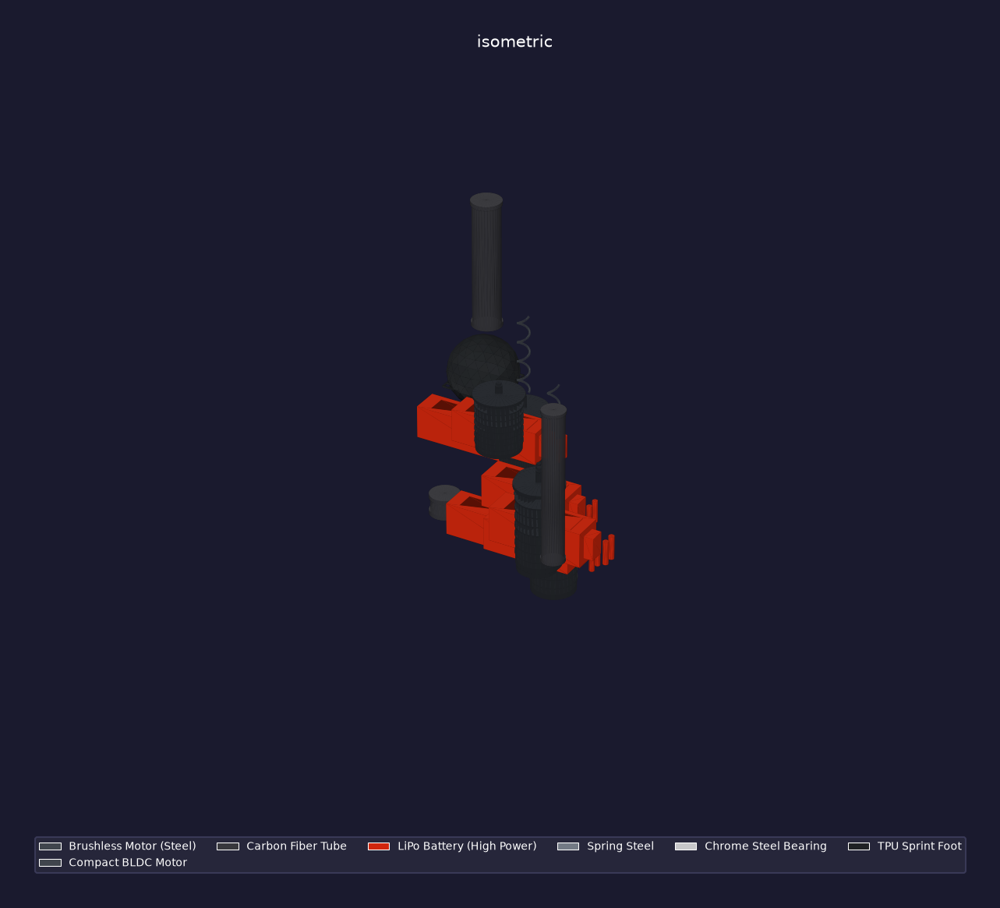
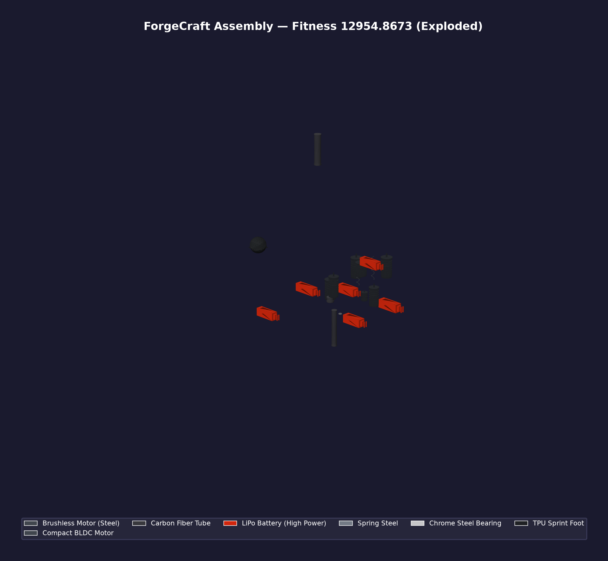

# ForgeCraft

[](https://github.com/jige0611/forgecraft/actions/workflows/test.yml)
[](https://www.python.org/)
[](LICENSE)

> 基于强化学习的机械形态协同进化框架  
> RL-based Mechanical Morphology Co-Evolution Framework

**ForgeCraft** 将强化学习 (PPO + GNN) 与进化算法 (NSGA-II + MAP-Elites) 结合，自动设计、评估并优化机械形态。流水线覆盖：从零件箱生成形态 → GNN 形态编码 → PPO 策略训练 → MuJoCo 物理评估 → STL / STEP / DXF / URDF / BOM 等制造文件导出。

> **当前状态 (v0.4.0，研究原型)**：形态的根节点现已带自由关节（`forgecraft/simulation/builder.py` 为根 body 输出 `<freejoint/>`），位移 / 跌落 / 速度类奖励项在默认配置下可正常收到信号，搜索因此具备运动梯度。此前版本中根节点被焊死在世界坐标系，这些奖励恒为 0 —— 该缺陷的修复与实测证据见文末[已知限制](#已知限制)开头的「已修复」条目。

---

## 快速开始

### 安装

```bash
# 1. 核心安装 (Python >= 3.10) — 仿真 / 形态建模 / 几何与网格处理
pip install -e .

# 2. 开发环境 (含 pytest / ruff)
pip install -e ".[dev]"

# 3. (可选) GPU 仿真 (Genesis World, Python < 3.14)
pip install -e ".[gpu]"

# 4. (可选) 按需启用其他能力
pip install -e ".[dashboard]"   # 实时 Web 看板 (fastapi + uvicorn)
pip install -e ".[hpo]"         # 超参数优化 (optuna)
pip install -e ".[dist]"        # Ray 分布式
pip install -e ".[mfg]"         # 展示套件: STL 工具 + 离线渲染 (numpy-stl, matplotlib)
pip install -e ".[deploy]"      # ONNX 跨平台部署
pip install -e ".[analysis]"    # 有限元 / 等几何分析

# 5. 一键安装全部
pip install -e ".[all]"
```

> GLB / glTF 导出依赖 `scipy`（trimesh 面着色路径），已含在核心依赖中。
> `renders/` 下的离线渲染图依赖 `matplotlib`（`.[mfg]` 或 `.[all]`）。

### 30 秒进化一把

```bash
# CPU 模式 (默认)
python -m forgecraft.main --population 20 --generations 10

# GPU 模式 (需要 CUDA)
python -m forgecraft.main --cuda --population 50 --generations 50

# 导出制造文件: STL / STEP / 3MF / URDF / BOM + 制造性报告
python -m forgecraft.main --generations 100 --export --export-dir design_output

# 列出可用的零件箱 / 任务
python -m forgecraft.main --list-catalogs
python -m forgecraft.main --list-tasks
```

### 从已有 best_body.json 单独导出

```bash
# 输出: STL / URDF / BOM / manufacturability.json / body.json
# --catalog 需与生成该形态时所用零件箱一致, 否则质量与材料估算会失真
python -m forgecraft.manufacturing --body-file design_output/best_body.json --catalog speedster

# 输出目录默认 design_output, 可用 --output 指定
python -m forgecraft.manufacturing --body-file design_output/best_body.json --catalog speedster --output out
```

需要 **STEP / DXF 工程图 / GLB / 渲染图 / 生产包** 时，走 Python API 的增强导出链路
（`examples/demo_robot/` 即由该链路生成）：

```python
from forgecraft.manufacturing import export_all_enhanced

export_all_enhanced(body_data, catalog_specs, "design_output")
```

---

## 示例产物

`examples/demo_robot/` 是一次进化（第 89 代）的交付物快照，用于展示**几何建模与制造导出链路**：

| 文件 | 说明 |
|------|------|
| `best_body.json` | 最佳形态（25 零件 / 24 关节；零件树 + 关节定义） |
| `evolution_history.json` | 逐代适应度记录 |
| `gen89_ind005_report.md` | 制造性报告（含可制造性评分与诊断告警） |
| `gltf/gen89.glb` | 装配体 glTF 2.0 二进制（任意 glTF 查看器可打开） |
| `gltf/gen89_exploded.glb` | 爆炸视图模型 |
| `renders/` | 13 张离线渲染图（7 视角 + 3 视角论文图，各有正常/爆炸两版） |
| `parts_showcase/` | 参数化零件特写图（**静态插图**：由仓库外的辅助脚本生成，无法由本仓库代码复现） |
| `bom.json` / `manufacturability.json` | 材料清单（5.244 kg / $157.31）+ 可制造性评分（总分 0.9925 / 可制造性 0.70） |
| `3d_viewer.html` | 单文件网页查看器（浏览器直接打开，需外部 glTF 场景） |

> ⚠️ 该快照展示的是**形态-控制协同进化的产物**：fitness 12954.87，含
> `speed` 2497.80、`displacement` 10452.36 等非零运动分量，**8 个驱动关节**，
> 根节点带自由关节（`<freejoint/>`），位移 / 速度奖励项能正常收到信号。
> 但注意其 120 对零件碰撞、11 条异常关节范围，以及**三处互不相等的质量估计**
> （5.244 / 6.233 / 7.005 kg），说明流水线产出的仍是一个**原型级形态**，
> 不是工程级设计。参见文末[已知限制](#已知限制)。





---

## 核心能力

```
┌──────────┐    ┌──────────┐    ┌──────────┐    ┌──────────┐    ┌──────────┐
│ 形态生成  │ →  │ GNN 编码 │ →  │ PPO 训练 │ →  │ 物理仿真 │ →  │ 制造导出  │
│ catalog   │    │ encoder  │    │ policy   │    │ MuJoCo   │    │ STL/URDF │
│ generator │    │ batch    │    │ rollout  │    │ Genesis  │    │ STEP/BOM │
└──────────┘    └──────────┘    └──────────┘    └──────────┘    └──────────┘
      ↑                               │                               │
      │         进化引擎 (NSGA-II + MAP-Elites + 课程学习)             │
      └───────────────────────────────┴───────────────────────────────┘
```

| 功能 | 描述 |
|------|------|
| **形态自动设计** | 从零件箱 (catalog) 组装任意拓扑的机械形态 |
| **GNN 形态编码** | 图神经网络将形态编码为固定维度向量 |
| **PPO 强化学习** | 形态条件 Actor/Critic 策略训练（每个个体在其评估预算内独立训练，见已知限制） |
| **物理仿真** | MuJoCo (CPU)；`genesis` 后端为可选依赖，本仓库未附带性能基准数据 |
| **多目标进化** | NSGA-II Pareto 前沿 + MAP-Elites 质量多样性 |
| **制造导出** | STL / STEP AP242（镶嵌几何）/ DXF 工程图 / URDF / ONNX / BOM / GLB / 生产包 |
| **错误恢复** | 原子断点 + 6 级降级保护 |
| **HPO 自动优化** | Optuna TPE + Bayesian GP 自动调参 |

---

## 架构

```
forgecraft/
├── core/              # 形态建模 + 零件箱 + 生成器
│   ├── morphology.py      MechanicalBody / Part / Joint 数据结构
│   ├── catalog.py         零件箱 (电机/杆材/轮子/脚...)
│   ├── generator.py       随机形态生成器
│   ├── loader.py          零件箱 & 任务加载
│   └── validation.py      运行时参数校验
│
├── rl/                # 强化学习
│   ├── encoder.py         GNN 形态编码器 (消息传递 + 注意力)
│   ├── ppo.py             PPO 训练器 (PPOBuffer + advantage 计算)
│   ├── morph_transfer.py  形态迁移学习 (MorphConditionalActor/Critic)
│   ├── pretrain.py        编码器预训练 (SimCLR 对比学习)
│   ├── batch_encoder.py   批量 GNN 编码器
│   ├── batch_ppo.py       批量 PPO rollout (借鉴 CleanRL)
│   ├── incremental_encoder.py 增量 GNN 编码 (变异局部重计算)
│   └── env.py             MuJoCo 强化学习环境
│
├── evolution/         # 进化引擎
│   ├── loop.py            进化主循环 (EvolutionLoop)
│   ├── breeder.py         种群繁殖器 (选择 + 交叉 + 变异)
│   ├── evaluator.py       种群评估器 (UCB 渐进式预算)
│   ├── operators.py       遗传算子 (变异/交叉 + 10+ 变异子)
│   ├── selection.py       选择算子 (精英/锦标赛/Pareto)
│   ├── adaptive_mutation.py 自适应变异 (多样性驱动)
│   ├── map_elites.py      MAP-Elites 质量多样性
│   ├── hyperparam_opt.py  超参数优化 (Optuna)
│   ├── recovery.py        错误恢复 (原子断点 + 6 级降级)
│   └── distributed.py     分布式评估 (Ray + 多进程)
│
├── simulation/        # 物理仿真
│   ├── builder.py         MuJoCo MJCF 场景构建
│   ├── terrain_curriculum.py 地形课程学习
│   ├── genesis_backend.py Genesis GPU 后端
│   └── backend_registry.py  多后端注册表
│
├── evaluation/        # 评估指标
│   ├── fitness.py         多目标适应度 (速度/能耗/稳定性/...)
│   ├── metrics.py         制造性评估指标
│   └── gpu_engine.py      GPU 加速评估引擎
│
├── geometry/          # 参数化几何 (产品级建模)
│   ├── parametric.py      9 种零件参数化生成器 (电机/轴承/底盘/弹簧/脚/电池...)
│   ├── materials.py       PBR 材质预设 (碳纤维 / 7075 铝 / 铬钢 / LiPo / TPU)
│   ├── gltf_scene.py      glTF 2.0 导出 (正常 / 爆炸双模式)
│   ├── exploded.py        爆炸图层级展开
│   └── pbr_renderer.py    离线渲染 (matplotlib 3D + 逐面 PBR 近似着色, 默认 250 DPI)
│
├── analysis/          # 有限元 / 等几何分析 (IGA)
│   ├── fea.py             结构有限元 (应力 / 模态)
│   ├── iga_*.py           等几何分析 (热 / 流体 / 断裂 / 多物理场)
│   └── topology.py        拓扑优化
│
├── cam/               # 增材制造前处理
│   ├── slicer.py          切片引擎
│   ├── infill/            填充图案 (gyroid / honeycomb / lightning ...)
│   └── gcode_writer.py    G-code 输出
│
├── manufacturing/     # 制造导出
│   ├── __init__.py           导出总入口 (export_all / export_all_enhanced)
│   ├── step_exporter.py      STEP AP242 装配体导出 (镶嵌三角面, 非解析 B-rep)
│   ├── drawing_generator.py  2D 工程图 (DXF + 公差标注)
│   ├── interference_checker.py 零件干涉 / 配合检查
│   ├── production_packager.py  一体化交付包 (ZIP)
│   ├── realtime_feedback.py  实时制造性反馈 (进化中嵌入)
│   └── onnx_deploy.py        ONNX 部署验证
│
├── knowledge/         # 知识存储 (关系 / 图 / 向量)
├── llm/               # LLM 辅助设计 (Agent + 子代理)
│
├── experiment/        # 实验管理
│   └── management.py      实验追踪 + 对比 + 实验清单
│
├── testing/           # 测试
│   ├── test_suite.py      核心单元测试
│   └── integration/       集成测试 (端到端进化 / 制造导出)
│
├── config.py          # 全局配置 (SimConfig / RLConfig / EvolutionConfig)
├── main.py            # CLI 入口
└── dashboard*.py      # Web 可视化仪表盘
```

---

## CLI 参数

常用参数（完整列表见 `python -m forgecraft.main --help`）：

```
python -m forgecraft.main [OPTIONS]

  --generations N         进化代数 (默认: 10)
  --population N          种群规模 (默认: 16)
  --elites N              精英保留数 (默认: 3)
  --cuda                  启用 GPU 加速
  --workers N             并行进程数 (默认: 4)
  --catalog NAME          零件箱 (默认: primitives)
  --task NAME             任务 (默认: speed)
  --seed SEED             随机种子 (默认: 42)
  --output DIR            结果输出目录
  --export                导出制造文件 (STL / STEP / 3MF / URDF / BOM)
  --export-dir DIR        导出目录 (默认: design_output)
  --quality LEVEL         几何精度 low|medium|high|ultra (默认: high)
  --resume PATH           从断点恢复
  --checkpoint-every N    每 N 代自动保存 (默认: 5)
  --curriculum            启用课程学习
  --pretrain              预训练编码器 (SimCLR)
  --map-elites            启用 MAP-Elites
  --hpo                   超参数优化
  --distributed           分布式计算 (Ray)
  --experiment-name NAME  实验追踪
  --turbo                 极速模式 (torch.compile)
  --quick                 快速测试
  --dashboard             Web 仪表盘
```

> `--catalog` 默认值为 `primitives`；`examples/demo_robot/` 使用的是 `speedster` 零件箱，
> 复现该快照时需显式指定。

---

## 配置

所有参数通过 dataclass 集中管理 (`forgecraft/config.py`)：

```python
from forgecraft.config import EvolutionConfig, RLConfig, SimConfig

evo = EvolutionConfig(
    population_size=50,
    generations=200,
    mutation_rate=0.35,
)

rl = RLConfig(
    hidden_dim=128,
    gnn_layers=3,
    actor_lr=3e-4,
    ppo_epochs=12,
)

sim = SimConfig(
    timestep=0.005,
    max_steps=500,
)
```

---

## 编程 API

```python
from forgecraft.evolution.loop import EvolutionLoop
from forgecraft.config import EvolutionConfig, TaskConfig
from forgecraft.core.loader import load_catalog, load_task

# 1. 加载零件箱和任务
catalog = load_catalog("primitives")
task = load_task("speed").to_task_config()

# 2. 创建进化循环
loop = EvolutionLoop(
    evo_config=EvolutionConfig(population_size=30),
    task_config=task,
    catalog=catalog.to_part_specs(),
    device="cuda",
    enable_map_elites=True,
)

# 3. 进化
loop.initialize_population()
loop.run(n_generations=100)

# 4. 导出
from forgecraft.manufacturing import export_from_evolution_loop
export_from_evolution_loop(loop, output_dir="design_output")
```

---

## 后端切换

```bash
# MuJoCo CPU (默认)
FORGECRAFT_BACKEND=mujoco python -m forgecraft.main

# Genesis GPU 后端 (可选, 需要 Python < 3.14)
pip install genesis-world
FORGECRAFT_BACKEND=genesis python -m forgecraft.main --cuda
```

代码切换：
```python
from forgecraft.simulation.backend_registry import BackendRegistry
print(BackendRegistry.get_status())
evaluator = BackendRegistry.create_evaluator("genesis", ...)
```

---

## 测试

测试分为两套：`forgecraft/testing/`（核心单元 + 集成）与 `tests/`（模块级单元测试）。

```bash
# 全量回归（两套一起，424 项）
pytest

# 仅核心单元测试
pytest forgecraft/testing/test_suite.py -v

# 仅集成测试
pytest forgecraft/testing/integration/ -v

# 跳过慢速用例
pytest -m "not slow"
```

---

## Docker

```bash
# CPU 版本
docker compose up forgecraft

# GPU 版本 (需要 nvidia-container-toolkit)
docker compose up gpu

# 快速跑一次
docker compose run forgecraft --quick
```

---

## 系统要求

| 组件 | 最低 | 推荐 |
|------|------|------|
| Python | 3.10+ | 3.12 |
| GPU | 无 (CPU) | RTX 3060+ / 8GB VRAM |
| RAM | 8 GB | 32 GB+ |
| MuJoCo | 3.0+ | 最新 |
| OS | Windows/Linux/Mac | Linux (CUDA) |

---

## 可选：标准件库

`scripts/` 下的 `extract_nopscad_dimensions.py` 等脚本可从 [NopSCADlib](https://github.com/nophead/NopSCADlib)
提取标准件（螺丝 / 螺母 / 轴承）尺寸并生成 STL 网格。

该库以 **GPL-3.0** 分发，与本项目的 MIT 许可不兼容，因此**未包含在本仓库内**。
如需使用请自行获取（生成网格还需安装 [OpenSCAD](https://openscad.org/)）：

```bash
git clone https://github.com/nophead/NopSCADlib.git
```

---

## 已知限制

本节如实列出当前版本的已知缺陷与范围边界。这些是**明确记录**的限制，而非未知问题。

> **已修复：根节点缺失自由关节。** 早期版本中 `forgecraft/simulation/builder.py`
> 为根 body 只输出 `<body name="..." pos="...">`，**没有** `<freejoint/>`
> （该元素仅出现在降级路径 `_build_fallback_xml()` 中），导致根节点被焊死在世界坐标系：
> 编译后自由度只等于内部关节数，`framepos` 质心传感器的 z 分量恒定，
> `_com_z < fall_height` 形式的终止条件永不触发，`displacement` / `speed` / `velocity`
> 奖励项恒为 0，搜索因此拿不到任何运动信号。
>
> 本版本已在根 body 注入 `<freejoint/>`。实测：6 零件 / 5 声明关节（2 铰链 + 3 固定）
> 的体编译后 `nq = 9, nv = 8`（自由关节占 7 个 qpos / 6 个 dof），首关节
> `type=free qposadr=0 dofadr=0`，铰链分别位于 `qposadr = 7, 8`；
> 在 300 步无动作 rollout 中质心 z 由 0.476 降至 0.191（Δ = −0.286 m）、
> 质心 x 位移 0.064 m，跌落终止在第 299 步触发。修复前这些量全为 0。
>
> 该缺陷同时掩盖了 `rl/env.py` 中两处错误，此处一并修复：`step()` 原先把
> `sensordata` 得到的 numpy 标量比较结果直接当作布尔量返回，`truncated` 因而为
> `np.bool_` 而非 Python `bool`（违反 Gymnasium 契约）；`reset()` 原先用关节索引
> 去改写 `qpos`，在有自由关节时会把基座位置与四元数一起扰动（关节索引与 qpos
> 索引不再对应）。现在 `reset()` 按 `jnt_qposadr` 寻址并跳过自由/球形关节，
> `step()` 显式返回 Python `bool`。
>
> **端到端验证**：修复后重跑完整进化（`--catalog speedster --task speed
> --population 32 --generations 100 --seed 42`），产出的 `examples/demo_robot/`
> 快照 fitness = 12954.87，其中 `speed` = 2497.80、`displacement` = 10452.36
> 均为**非零**（修复前这两项恒为 0，只有 `upright` 非零）；自动种子也首次
> 找到含 **8 个驱动关节** 的形态，而不再是「0 驱动关节」。

### 1. 每个个体独立训练策略，而非共享单一策略

进化循环中每次个体评估都会新建一个 `PPOTrainer`（可经 `prev_trainer_state`
继承上一代状态），并在该个体自身的评估预算内做 PPO 更新。
因此**不存在**一个跨拓扑泛化的单一策略网络；GNN 形态编码提供的是
条件输入，而非共享的通用控制器。跨拓扑零样本迁移属于未来工作。

### 2. 演示形态仍是原型级，不是工程级设计

`examples/demo_robot/gen89_ind005_report.md` 记录的 gen89 个体：

| 项目 | 数值 |
|------|------|
| 零件 / 关节 | 25 / 24 |
| 驱动关节（`actuated > 0.5`） | 8 |
| 适应度 / 速度 / 位移分量 | 12954.87 / 2497.80 / 10452.36 |
| 总质量 | 6.233 kg |
| 可制造性总分 / 可制造性得分 | 0.9925 / 0.70 |
| 零件间碰撞对 | 120 |
| 关节范围告警 | 11 条（6 条塌缩为 `[0, 0]`，5 条跨度超过 4π rad，最大 888.18 rad） |
| BOM 成本 / 报告成本 | $157.31 / $442.11（两处用不同公式，见下） |
| 3D 打印耗时 / 耗材 | 85.0 h / 2862 g |

> 注：同一个形态的**质量出现三个互不相等的数字** —— `bom.json` 给 5.244 kg、
> 制造性报告给 6.233 kg、`manufacturability.json` 的 `torque_budget.total_mass`
> 给 7.005 kg；成本同样不一致（$157.31 vs $442.11）。三处各自按不同公式
> 由包围盒或零件参数推算体积与单价，代码里没有对账。我们如实列出全部，
> 而不是挑最好看的那个。

**为什么它仍是原型级**：适应度函数的权重使搜索偏向"能跑起来"，代价是
零件互相穿插（120 对碰撞）、关节限位被推到无物理意义的大范围（如 888 rad），
总质量与成本也偏高。这不影响流水线本身的可用性——它恰恰说明**适应度函数
尚未包含自碰撞惩罚与关节限位的物理合理性约束**，该部分属于未来工作。
解读该形态时请把它当作"链路贯通 + 搜索能拿到运动信号"的证据，
而不是"进化出了性能优异的机器人"的证据。

### 3. STEP 导出为镶嵌几何

`manufacturing/step_exporter.py` 输出的是 AP242 文件（`FILE_SCHEMA`
`AP242_MANAGED_MODEL_BASED_3D_ENGINEERING_MIM_LF`），几何实体为
`TESSELLATED_ITEM` + `COORDINATES_LIST` + `TRIANGULATED_FACE`，
即**三角网格镶嵌**，不是解析 B-rep（无 NURBS 曲面与拓扑边）。可被支持
AP242 镶嵌的查看器打开，但无法直接用于参数化 CAD 建模。

### 4. glTF / 渲染的依赖与保真度

- GLB 导出需要 `scipy`（trimesh 面着色 → `scipy.sparse`），已加入核心依赖；
- `renders/` 下的图由 matplotlib 3D 生成，采用**逐面** PBR 近似着色
  （Lambert 漫反射 + Blinn-Phong 高光 + Fresnel，视线方向固定为 +Z，三光源加权）；
  它不是光线追踪或 IBL，属于示意级渲染，不适用于材质对比。

### 5. 缺少性能基准

本仓库**不附带**任何 FPS / 加速比基准数据。`genesis` 后端为可选依赖，
需要单独安装并自行实测；此前文档中出现过的吞吐数字已移除。

### 6. `parts_showcase/` 中的插图不可复现

`examples/demo_robot/parts_showcase/` 下的三张 PNG 由仓库**外**的辅助脚本生成，
仓库内没有任何代码路径能重新产生它们。它们仅作为静态插图保留；
`renders/` 下的 13 张图则可由 `export_presentation_suite` / `render_paper_suite` 完整复现。

### 7. 分布式评估路径的验证范围

`forgecraft/evolution/distributed.py` 的 Ray 与 multiprocessing 两条路径均复用与
进程内路径**同一个**评估实现（`_evaluate_body_worker_ucb`，含真实 rollout 与 PPO 更新），
因此结果口径一致；但本仓库展示的所有结果都由进程内并行评估器产生，
**未附带**任何 Ray 集群的实测数据。此外 `RedisTaskQueue` 仅提供任务/结果队列原语，
未接入 `evaluate_population`，需自行实现消费端。

### 8. FEA 在包围盒网格上求解，不是零件几何

`forgecraft/analysis/fea.py` 的网格划分（`surface_to_tetrahedralize`）只取零件的**包围盒**
（`extents = bmax - bmin`）并切成规则网格，生成的体单元填满整个长方体，
**不是对零件表面几何做四面体剖分**。因此应力 / 位移 / 安全系数只反映"与零件同外廓尺寸的
实心块"，不能用来判断实际零件是否会断裂。`analysis/` 包下的 IGA、多物理场等模块
同样未接入进化或制造主链路，属独立 API，未在本文结果中使用。

### 9. 拓扑优化的"柔度"不是力学柔度

`forgecraft/analysis/topology.py` 的 SIMP 循环**没有组装或求解** `Ku = f`
（`scipy.sparse.linalg.spsolve` 被 import 但从未调用）。其"灵敏度"为
`dc = -p·x^(p-1)`，只依赖密度场本身，不含位移 `u` 与单元刚度 `K0`；
也就是说它是在体积约束下重新分配材料，**不包含任何结构力学计算**。
返回结果中的 `compliance` 字段被硬编码为 `0.0`，不可当作柔度值引用。

---

## 论文引用

本项目整合了以下领域的工作：

- **强化学习** — PPO (Schulman et al. 2017), GAE (Schulman et al. 2016)
- **图神经网络** — Message Passing GNN (Gilmer et al. 2017)
- **进化算法** — NSGA-II (Deb et al. 2002), MAP-Elites (Mouret & Clune 2015)
- **形态进化** — RoboGrammar (Zhao et al. 2020), EvoCraft
- **物理仿真** — MuJoCo (Todorov et al. 2012), Genesis World (2025)
- **制造性** — DfAM (Design for Additive Manufacturing)

---

## 许可证

MIT License

---

**ForgeCraft** — 从零到制造，自动设计最优机械形态。
